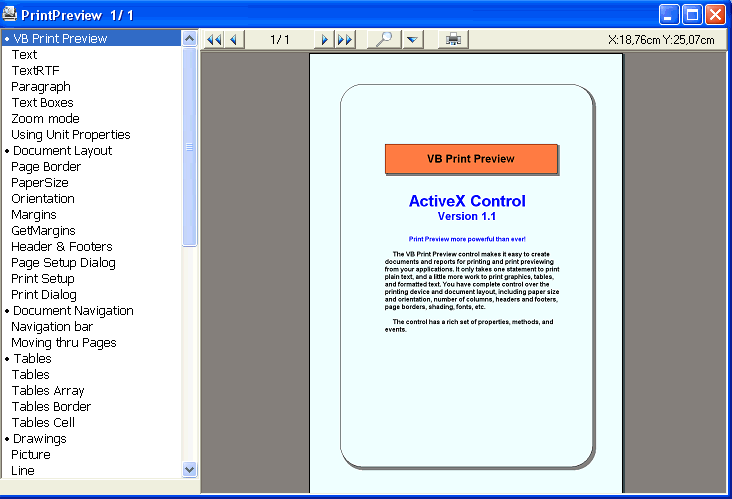



## Print Preview  more powerful than ever\! \(Update v\.1\.0\.2\)

### Description

Print Preview more powerful than ever!

View, format, export, and print documents like never before.

VBPrintPreview is work for document viewing and printing.

Give more power and flexibility.

VbPrintPreview makes it easy to add robust View, Format, Export,

and Print capabilities to your Visual Basic applications. It replaces

the Printer Object in Visual Basic to significantly expand, yet

simplify, printing functionality. 

Making it easy to create documents with consistent formatting.

You have full control of the formatting of paragraphs,tables, fonts,

colors, alignment, and justification. 

Include help and examples

Fix Orientation for multi page

Support LynxGrid

 
### More Info
 

             |
---                |---
**Submitted On**   |2011-07-07 00:18:02
**By**             |[Diomidisk](https://github.com/Planet-Source-Code/PSCIndex/blob/master/ByAuthor/diomidisk.md)
**Level**          |Advanced
**User Rating**    |5.0 (65 globes from 13 users)
**Compatibility**  |VB 6\.0
**Category**       |[OLE/ COM/ DCOM/ Active\-X](https://github.com/Planet-Source-Code/PSCIndex/blob/master/ByCategory/ole-com-dcom-active-x__1-29.md)
**World**          |[Visual Basic](https://github.com/Planet-Source-Code/PSCIndex/blob/master/ByWorld/visual-basic.md)
**Archive File**   |[Print\_Prev220767762011\.zip](https://github.com/Planet-Source-Code/diomidisk-print-preview-more-powerful-than-ever-update-v-1-0-2__1-73982/archive/master.zip)

